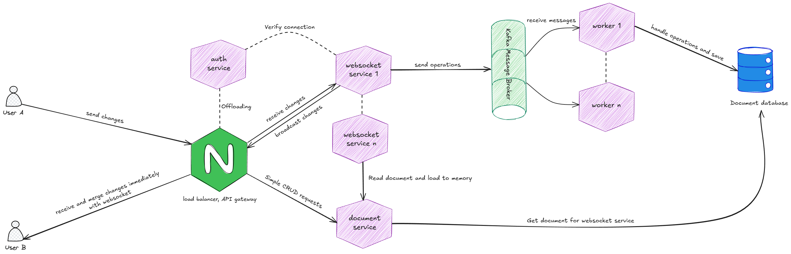

# Dự án Collab Notes – Nền tảng Chỉnh sửa Tài liệu Thời gian Thực

## Mục lục

1. [Mô tả Dự án](#1-mô-tả-dự-án)
2. [Các Nhiệm Vụ Đã Hoàn Thành](#2-các-nhiệm-vụ-đã-hoàn-thành)
   - [2.1. Kiến trúc gốc & Bài toán mở rộng](#21-kiến-trúc-gốc--bài-toán-mở-rộng)
   - [2.2. Các giải pháp cải tiến & Các thách thức kỹ thuật](#22-các-giải-pháp-cải-tiến--các-thách-thức-kỹ-thuật)
     - [2.2.1. Mở rộng nhiều server](#221-mở-rộng-nhiều-server)
     - [2.2.2. Tách biệt trách nhiệm (Separation of Concerns)](#222-tách-biệt-trách-nhiệm-separation-of-concerns)
     - [2.2.3. Chiến lược Xác thực & Bảo mật](#223-chiến-lược-xác-thực--bảo-mật)
     - [2.2.4. Cơ chế Đồng bộ & Giải quyết Xung đột](#224-cơ-chế-đồng-bộ--giải-quyết-xung-đột)
3. [Kiến trúc Triển Khai Hiện Tại](#3-kiến-trúc-triển-khai-hiện-tại)
4. [Cách Sử Dụng](#4-cách-sử-dụng)
   - [4.1. Yêu Cầu Hệ Thống](#41-yêu-cầu-hệ-thống)
   - [4.2. Khởi Chạy Hệ Thống](#42-khởi-chạy-hệ-thống)
   - [4.3. Sử Dụng Ứng Dụng](#43-sử-dụng-ứng-dụng)
   - [4.4. Dừng Hệ Thống](#44-dừng-hệ-thống)
5. [So sánh hiệu năng](#5-so-sánh-hiệu-năng)
   - [5.1. Mô tả kịch bản kiểm thử](#51-mô-tả-kịch-bản-kiểm-thử)
   - [5.2. Mô tả kết quả](#52-mô-tả-kết-quả)
   - [5.3. Kết luận](#53-kết-luận)
6. [Thành Viên Nhóm](#6-thành-viên-nhóm)

---

## 1. Mô tả dự án

Collab Notes là một nền tảng web cho phép nhiều người dùng cùng chỉnh sửa tài liệu theo thời gian thực, tương tự Google Docs. Hệ thống sử dụng Kafka làm xương sống cho luồng dữ liệu, MongoDB cho lưu trữ phi cấu trúc, và thuật toán **CRDT (Conflict-free Replicated Data Types)** thông qua thư viện Yjs để xử lý logic cộng tác.

---

## 2. Các nhiệm vụ Đã hoàn thành

- **Xây dựng hệ thống:** Tách biệt các service: Auth, Doc, Websocket, Worker, Client, Nginx.
- **Chỉnh sửa tài liệu realtime:** Sử dụng Yjs, y-websocket, Quill, Kafka để đồng bộ nội dung giữa nhiều người dùng.
- **Xác thực bảo mật:** Đăng ký, đăng nhập, xác thực JWT, refresh token, phân quyền truy cập tài liệu.
- **Mời cộng tác viên, theo dõi online:** Quản lý cộng tác viên, hiển thị trạng thái online.
- **Load balancing, scale service:** Hỗ trợ scale nhiều instance cho websocket-service, worker.
- **Container hóa:** Docker hóa toàn bộ hệ thống, quản lý bằng Docker Compose.

### 2.1. Phiên bản đơn giản (Kiến trúc gốc)

**1. Server "ôm" quá nhiều trách nhiệm**

- Tất cả logic đều nằm chung một chỗ. Một server Node.js duy nhất phải gánh vác mọi công việc: từ đăng nhập, quản lý kết nối WebSocket, đến ghi dữ liệu vào Database.
- **Hậu quả:** Code trở nên rối rắm, khó sửa lỗi. Nếu chức năng lưu file bị lỗi, toàn bộ hệ thống (bao gồm cả đăng nhập) sẽ sập theo.

**2. Không có cơ chế xử lý xung đột**

- Hệ thống chỉ đơn thuần nhận văn bản từ người A và gửi cho người B mà không có thuật toán hòa trộn (như CRDT hiện tại).
- **Hậu quả:** Xảy ra tình trạng "Ghi đè" (Last Write Wins). Nếu hai người cùng sửa một câu tại cùng một thời điểm, dữ liệu của người gửi sau sẽ đè mất dữ liệu của người trước.

**3. Dễ "treo" khi có nhiều người dùng**

- Dữ liệu được ghi thẳng vào Database (MongoDB) mỗi khi người dùng gõ phím mà không có hàng đợi (Queue).
- **Hậu quả:** Khi số lượng người dùng tăng lên, Database không kịp xử lý, khiến server bị tắc nghẽn. Kết quả là ứng dụng bị lag, mất kết nối và không phản hồi.

### 2.2. Các giải pháp cải tiến & Các thách thức kỹ thuật

### 2.2.1. Mở rộng nhiều server

Khi hệ thống đơn lẻ bị quá tải, giải pháp đầu tiên nhóm nghĩ đến là:  
**"Nếu 1 server không chịu nổi, hãy chạy nhiều server giống hệt nhau và chia đều công việc."**

**Hướng tiếp cận đầu tiên đã thử: Redis Pub/Sub:**

- **Cơ chế hoạt động:**

  - Chạy nhiều server Node.js song song và sử dụng Redis làm kênh trung gian để chuyển tiếp tin nhắn.
  - Khi Server A nhận được update từ người dùng, nó sẽ đẩy (Publish) gói tin đó lên Redis. Tất cả các server khác (B, C, D...) đều đăng ký (Subscribe) kênh này để nhận gói tin và gửi xuống cho người dùng của mình.

- **Mục tiêu:** Cho phép người dùng kết nối tới bất kỳ server nào cũng có thể nhìn thấy nhau.

- **Lý do từ bỏ phương án này:**

  - **Sự lãng phí tài nguyên do "Trùng lặp trạng thái" (Redundant In-Memory State):**

    Với thư viện Yjs, để merge được update từ người dùng, server buộc phải load toàn bộ cấu trúc dữ liệu của tài liệu đó vào RAM.

    Kịch bản: User A (kết nối Server 1) và User B (kết nối Server 2) cùng sửa Tài liệu X.

    Hậu quả: Để đồng bộ, cả Server 1 và Server 2 đều phải lưu trữ bản sao y hệt của Tài liệu X trong RAM.

    Kết luận: Nhóm nhận thấy tiêu tốn gấp đôi lượng RAM để xử lý cùng một tài liệu. Nếu mở rộng ra 10 server, lượng RAM tiêu tốn sẽ gấp 10 lần vô ích, khiến chi phí hạ tầng tăng vọt mà hiệu năng không tăng tương ứng.

  - **Chi phí Deserialization:**  
    Mỗi server đều phải tốn CPU để nhận tin nhắn từ Redis, giải mã (decode) nó chỉ để kiểm tra xem "Mình có user nào đang mở file này không?". 90% trường hợp là không, gây lãng phí tài nguyên CPU vô ích.

  - **Độ trễ cộng dồn:**  
    Việc phải đi vòng qua Redis (Client -> Server A -> Redis -> Server B -> Client) làm tăng thêm độ trễ (latency), ảnh hưởng đến cảm giác mượt mà khi gõ phím.

**Hướng tiếp cận cuối cùng: Mỗi một server phụ trách một tài liệu riêng, tất cả các user khi kết nối vào tài liệu đó sẽ chỉ kết nối vào 1 server**

- **Loại bỏ hoàn toàn cơ chế đồng bộ phức tạp:**  
  Vì tất cả người dùng đang sửa tài liệu xyz-123 đều đang ngồi chung một Server #1, việc đồng bộ diễn ra ngay trong bộ nhớ RAM của server đó. Tốc độ cực nhanh, không cần Redis Pub/Sub, không có độ trễ mạng giữa các server.

- **Tối ưu hóa RAM (Không còn dư thừa):**  
  Trạng thái của tài liệu xyz-123 chỉ tồn tại duy nhất trên Server #1. Server #2, #3 hoàn toàn không tốn 1 byte RAM nào cho tài liệu này.

Để hiện thực hóa kiến trúc "Một tài liệu - Một Server", vai trò của bộ cân bằng tải **(Load Balancer - Nginx)** là tối quan trọng. Nhóm đã đưa ra quyết định đánh đổi giữa tính phức tạp của hạ tầng và tốc độ phát triển:

- Trong các hệ thống quy mô lớn (như Google Docs, Figma), việc quyết định "Server nào sẽ phụ trách Tài liệu A?" là một thuật toán phức tạp dựa trên nhiều tiêu chí: vị trí địa lý, sức khỏe server, v.v.
- Để đơn giản hóa hạ tầng và tập trung tối đa vào logic realtime, nhóm chọn hướng tiếp cận thực dụng (pragmatic) thay vì các thuật toán định tuyến phức tạp.

**Giải pháp:**  
Sử dụng cơ chế phân phối Round Robin (mặc định của Nginx) kết hợp với Sticky Session (dựa trên docId).

**Cơ chế:**

- Request mở tài liệu đầu tiên được điều hướng xoay vòng.
- Nginx sẽ "ghim" tất cả các request tiếp theo mang cùng docId vào đúng server đã xử lý request đầu tiên đó.

**Hiệu quả:**

- **Triển khai nhanh:** Tận dụng tính năng có sẵn của Nginx, không cần xây dựng hệ thống Service Discovery phức tạp.
- **Đúng mục tiêu:** Đảm bảo tuyệt đối nguyên tắc "Cùng tài liệu - Chung Server", giúp dữ liệu được đồng bộ tức thì trong bộ nhớ RAM.

---

### 2.2.2. Tách biệt trách nhiệm (Separation of Concerns)

Sau khi giải quyết bài toán định tuyến, nhóm tiếp tục tối ưu hiệu năng bằng cách tách biệt hai luồng xử lý chính: luồng nóng (hot path) cho realtime và luồng lạnh (cold path) cho lưu trữ/đọc dữ liệu, dựa trên kiến trúc CQRS.

**A. Luồng Ghi & Xử lý Realtime (Write Path – Hot Path)**

- **Websocket Service (Producer):**  
  Tiếp nhận và phát tán các update (broadcast) giữa các user, tuyệt đối không kết nối trực tiếp tới MongoDB. Ngay khi nhận update, dữ liệu được đẩy vào Kafka theo kiểu "fire and forget", giúp giải phóng luồng chính để xử lý các request tiếp theo mà không bị chặn bởi I/O.

- **Apache Kafka:**  
  Đóng vai trò lớp đệm (buffer), điều tiết áp lực (back-pressure) khi lượng request tăng đột biến.

- **Worker Service (Consumer):**  
  Chạy nền (background), nhận dữ liệu từ Kafka và thực hiện batch write xuống MongoDB một cách bất đồng bộ, đảm bảo dữ liệu bền vững mà không ảnh hưởng đến hiệu năng realtime.

**B. Luồng Đọc (Read Path – Cold Path)**

- **Doc Service (REST API):**  
  Là cổng đọc duy nhất từ MongoDB, phục vụ hai mục đích:
  - Cung cấp metadata và nội dung cho client khi tải trang.
  - Hỗ trợ Websocket Service nạp dữ liệu (hydration) cho tài liệu chưa có trong RAM thông qua API nội bộ, thay vì truy cập DB trực tiếp.

**C. Giá trị kỹ thuật: Giải quyết nút thắt cổ chai (Bottleneck)**

Việc tách biệt triệt để hai luồng trên giúp khắc phục điểm yếu của Node.js:  
Các tác vụ nặng như truy vấn DB, parse dữ liệu lớn sẽ không còn làm "treo" event loop của Websocket Service. Nhờ đó, Websocket Service luôn sẵn sàng xử lý các kết nối realtime với độ trễ thấp, đảm bảo trải nghiệm mượt mà cho người dùng, kể cả khi hệ thống đang tải dữ liệu lớn cho user khác.

---

### 2.2.3. Chiến lược Xác thực & Bảo mật

Trong kiến trúc mới, việc xác thực nếu để từng service tự xử lý sẽ gây lặp code và khó đồng bộ. Để tối ưu, hệ thống sử dụng hai cơ chế riêng biệt cho HTTP và WebSocket:

**A. HTTP Request – Gateway offloading**

- Các request RESTful API đến các service đều được xác thực tại Nginx Gateway.
- Nginx nhận request kèm header Authorization: Bearer <token>, trực tiếp giải mã và xác thực JWT.
- Nếu hợp lệ, Nginx trích xuất thông tin user (User ID, Role) và gắn vào header nội bộ (ví dụ: X-User-Id), sau đó proxy pass đến service.
- Service chỉ cần đọc X-User-Id từ header, không phải thực hiện bất kỳ logic xác thực nào, giúp tập trung vào business logic và tiết kiệm tài nguyên.

**B. WebSocket Request – Xác thực chủ động tại tầng ứng dụng**

- Do trình duyệt không hỗ trợ gửi header Authorization khi bắt tay WebSocket, token phải truyền qua query parameter (ws://host?token=xyz).
- Nginx không xác thực JWT cho WebSocket, chỉ passthrough kết nối.
- Khi có sự kiện onConnection, Websocket Service lấy token từ URL và gọi nội bộ sang Auth Service để xác thực (verifyToken).
- Nếu token hợp lệ, kết nối được thiết lập; nếu không, Websocket Service sẽ đóng kết nối ngay lập tức.

Cách tiếp cận này giúp hệ thống vừa bảo mật, vừa tối ưu hiệu năng, đồng thời đảm bảo các service backend không phải xử lý xác thực lặp lại.

### 2.2.4. Cơ chế Đồng bộ & Giải quyết Xung đột (Conflict Resolution)

Trong hệ thống cộng tác realtime, xung đột xảy ra khi nhiều người dùng cùng chỉnh sửa một vị trí tại cùng thời điểm. Thay vì dùng cơ chế khóa (locking) gây chậm trễ, Collab Notes sử dụng thuật toán CRDT (Conflict-free Replicated Data Types) để đảm bảo mọi người dùng đều nhìn thấy nội dung nhất quán mà không cần server làm trọng tài.

**A. Nguyên lý cốt lõi – Tính nhất quán toán học**

- Hệ thống chấp nhận xung đột và giải quyết bằng thuật toán CRDT.
- Mọi thay đổi đều có tính giao hoán (commutative): Update A + Update B luôn cho kết quả giống Update B + Update A.
- Khi có xung đột (ví dụ: cùng chèn ký tự vào một vị trí), thuật toán sử dụng Client ID và Logical Clock để xác định thứ tự. Dù nhận dữ liệu theo thứ tự nào, kết quả cuối cùng trên mọi máy đều giống nhau.

**B. Luồng xử lý xung đột (End-to-End Flow)**

1. **Client (Local Update):**

   - Khi người dùng gõ phím, thay đổi được áp dụng ngay vào văn bản cục bộ (zero latency).
   - Ứng dụng đóng gói thay đổi thành một bản vá nhỏ dạng nhị phân gọi là Update Delta.

2. **Truyền tải (Transmission):**

   - Update Delta được gửi qua WebSocket lên server, tối ưu băng thông nhờ mã hóa nhị phân.

3. **Server (Broadcasting):**

   - Websocket Service chỉ đóng vai trò relay, không giải mã hay xử lý lại nội dung.
   - Song song: Broadcast Update Delta cho các client khác và đẩy vào Kafka để lưu trữ.

4. **Client khác (Remote Merge):**

   - Nhận Update Delta và thuật toán CRDT tự động hòa trộn vào văn bản hiện tại.
   - Nếu vị trí chèn trùng, thuật toán so sánh ID để quyết định thứ tự ký tự.

5. **Database (Persistence):**
   - Worker Service đọc Update Delta từ Kafka và merge vào trạng thái lưu trong MongoDB bằng y-mongodb-provider.
   - MongoDB lưu trạng thái dưới dạng Binary Blob, không lưu plain text, đảm bảo lịch sử chỉnh sửa và cấu trúc CRDT luôn chính xác.

**C. Tại sao không có xung đột giữa Client và Server?**

- Khác với mô hình RESTful truyền thống, hệ thống này loại bỏ hoàn toàn khái niệm xung đột Client-Server nhờ cơ chế append-only của CRDT.
- Server chỉ lưu trữ và chuyển tiếp các bản vá, không tự sinh ra nội dung chỉnh sửa.
- Mọi update từ client đều được merge vào lịch sử chung, không có thao tác ghi đè, đảm bảo không mất dữ liệu hay sai lệch phiên bản.

## 3. Kiến trúc triển khai hiện tại



**Các thành phần chính:**

- **Client:** React + Quill + Yjs-websocket, kết nối WebSocket để chỉnh sửa realtime.
- **Nginx:** API Gateway, load balancing, Gateway offloading.
- **Websocket Service:** Xử lý kết nối realtime, đồng bộ tài liệu sử dụng thuật toán CRDT từ thư viện Yjs.
- **Auth Service:** Đăng ký, đăng nhập, refresh token, xác thực người dùng.
- **Doc Service:** RESTful API quản lý metadata tài liệu, lấy trạng thái Yjs từ MongoDB.
- **Worker:** Nhận update từ Kafka, ghi xuống MongoDB (y-mongodb-provider).
- **MongoDB:** Lưu metadata, user, và các update Yjs.
- **Kafka:** Message queue cho các update realtime.

---

## 4. Cách sử dụng

### 4.1. Yêu cầu hệ thống

- Docker, Docker Compose
- (Tùy chọn) Prometheus, Grafana để giám sát

### 4.2. Khởi chạy hệ thống

```bash
git clone https://github.com/trungduc512/Collab_Notes.git
cd Collab_Notes
docker compose up --build
```

Có thể scale service:

```bash
docker compose up --build --scale websocket-service=n --scale worker=m
```

### 4.3. Sử dụng ứng dụng

- Truy cập ứng dụng tại [http://localhost:5173](http://localhost:5713)

### 4.4. Dừng hệ thống

```bash
docker compose down
# hoặc xóa cả volumes:
docker compose down -v
```

---

## 5. So sánh hiệu năng

### 5.1 Mô tả kịch bản kiểm thử

| Kịch bản | Loại kiểm thử | Mô tả                 | Mục đích                   |
| -------- | ------------- | --------------------- | -------------------------- |
| 1        | Cơ bản        | 1 req/s, 5 phút       | Đường cơ sở hiệu năng      |
| 2        | Ramp-up       | Tăng dần VUs, 19 phút | Xác định bottleneck        |
| 3        | Stress        | 100 VUs, 7 phút       | Kiểm tra giới hạn hệ thống |
| 4        | Soak          | 30 VUs, 1 giờ         | Đánh giá ổn định lâu dài   |

### 5.2 Mô tả kết quả

- **Kiến trúc cơ bản:** Xử lý nhanh khi tải nhẹ, nhưng không ổn định khi tải cao.
- **Tích hợp Kafka:** API response time ổn định, dễ scale, nhưng tốc độ xử lý file phụ thuộc vào số worker và partition Kafka.
- **Caching (nếu có):** Tăng tốc độ khi cache hit, hiệu quả phụ thuộc workload thực tế.
- **Multiple Workers:** Tăng throughput khi có đủ tài nguyên phần cứng.

### 5.3 Kết luận

- **Microservices + Kafka** là nền tảng bắt buộc cho hệ thống realtime, chịu tải lớn.
- **Caching** giúp tăng tốc, nhưng cần cân nhắc workload thực tế.
- **Scale worker/websocket-service** giúp tăng khả năng chịu tải, nhưng cần theo dõi tài nguyên hệ thống.

---

## 6. Thành viên nhóm

- Đỗ Trung Đức - 23020045 (Load Balancer, Gateway Offloading, CQRS, Message Queue, Conflict Resolve, Kafka Pub/sub)
- Trương Quang Duy - 23020033 (CQRS, Conflict Resolve, Redis Pub/Sub, Testing, Message Queue)
- Nguyễn Anh Hào - 23020060 (Gateway Offloading, Refresh Token/Access Token)
- Nguyễn Trọng Hiếu - 23020069 (Load Balancer, Cursor Indicator)

---

> Mọi đóng góp, issue, pull request đều được hoan nghênh!
